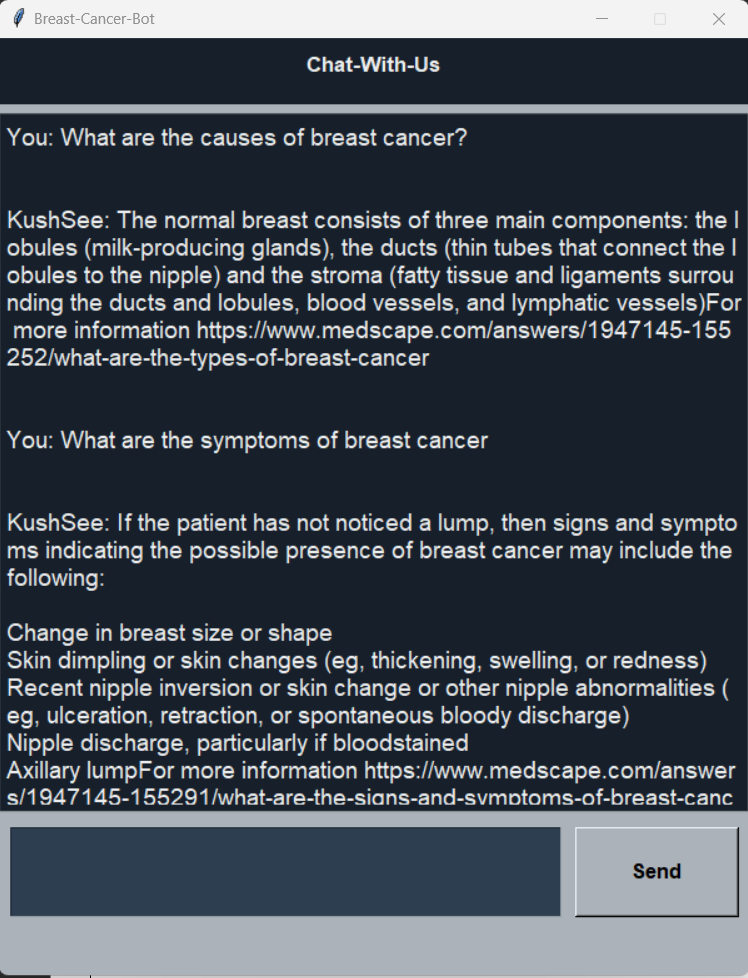

# HealthCare-Chatbot-1
A medical care chatbot, able to answer to user queries related to breast cancer

We create a contextual medical chatbot to answer to user query related to breast cancer. The chatbot uses NLP to extract intent from user query and then responds to it using the breast cancer data present in it's database.

The intents.json file contains about 180 questions related to breast cancer in the form of (tag, pattern, response) pairs.

This project was made by me and my friend for our minor project in persuit of our engineering degree.

### **Dependencies Used:**
```
1. Pytorch
2. NLTK
3. Tkinter
4. Numpy
5. JSON
```

<p></p>
### A snapshot of working of the chatbot
